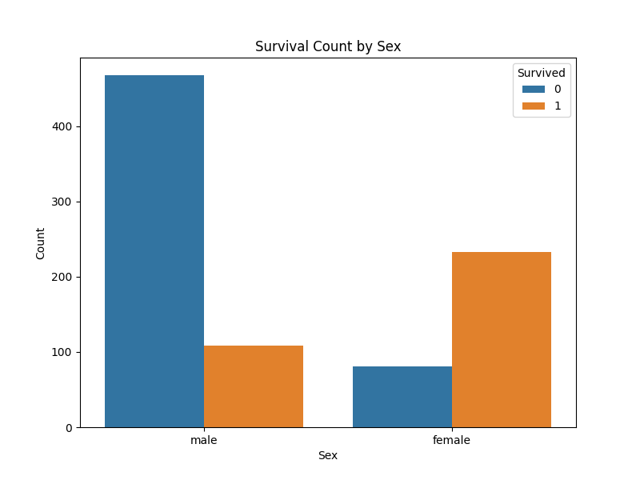
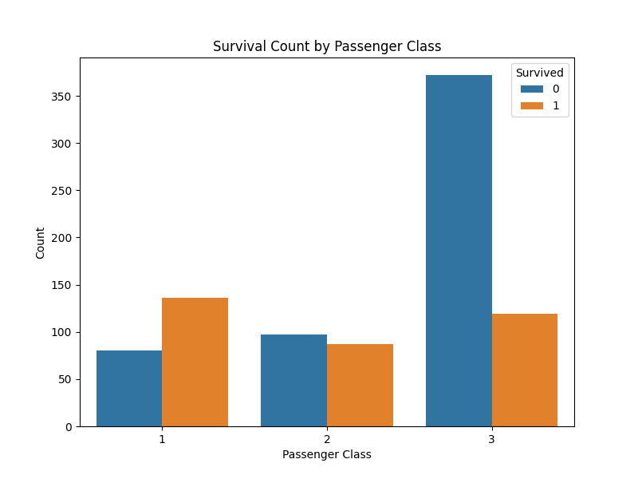
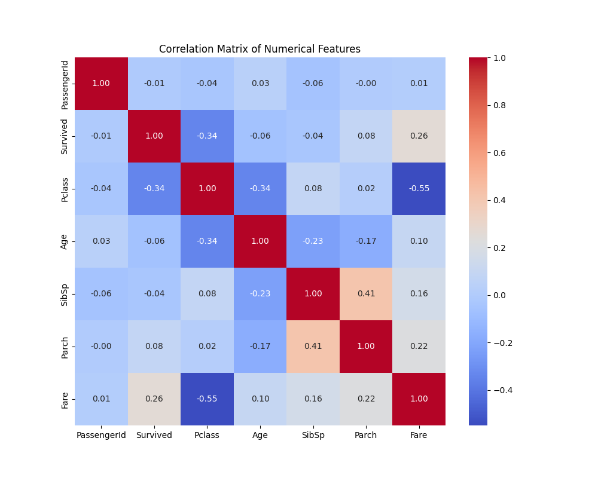

# Task 02: Data Cleaning and Exploratory Data Analysis (EDA) - Titanic Dataset

## Project Description

This task focuses on performing essential data cleaning and in-depth exploratory data analysis (EDA) on the well-known Titanic dataset. The primary goal is to understand the dataset's structure, identify data quality issues, explore relationships between various features, and uncover patterns that might contribute to predicting passenger survival.

## Dataset

* **Name:** Titanic - Machine Learning from Disaster
* **Source:** Kaggle (original competition data)
* **Files Used:**
    * `train.csv`: The training dataset, containing passenger information and the `Survived` target variable.
    * `test.csv`: The test dataset, containing passenger information, used for making predictions (though for EDA, we primarily focus on `train.csv` for survival analysis).
* **Key Columns:**
    * `PassengerId`: Unique ID for each passenger.
    * `Survived`: Survival status (0 = No, 1 = Yes) - **Target Variable**.
    * `Pclass`: Ticket class (1 = 1st, 2 = 2nd, 3 = 3rd).
    * `Name`: Passenger's name.
    * `Sex`: Passenger's gender.
    * `Age`: Passenger's age.
    * `SibSp`: Number of siblings/spouses aboard.
    * `Parch`: Number of parents/children aboard.
    * `Ticket`: Ticket number.
    * `Fare`: Passenger fare.
    * `Cabin`: Cabin number.
    * `Embarked`: Port of embarkation (C = Cherbourg, Q = Queenstown, S = Southampton).

## Objectives

* Identify and handle missing values effectively.
* Understand the distribution of individual features.
* Explore relationships between features, especially with the `Survived` variable.
* Identify potential outliers and anomalies.
* Uncover patterns and trends that could be useful for feature engineering or predictive modeling.

## Key Steps Performed

1.  **Data Loading and Initial Inspection:**
    * Loaded `train.csv` and `test.csv` into pandas DataFrames.
    * Used `df.info()`, `df.describe()`, `df.head()`, `df.isnull().sum()` to get a preliminary understanding of the data types, summary statistics, and missing values.

2.  **Data Cleaning:**
    * **Missing Values Handling:**
        * `Age`: [Describe your strategy, e.g., Imputed missing 'Age' values using the median or mean for respective passenger classes/titles.]
        * `Embarked`: [Describe your strategy, e.g., Imputed missing 'Embarked' values with the mode (most frequent port).]
        * `Cabin`: [Describe your strategy, e.g., Decided to drop the 'Cabin' column due to a high percentage of missing values, or extracted deck information.]
        * `Fare`: [Describe if you found any missing 'Fare' values and how you handled them, usually median/mean for Pclass.]
    * **Feature Transformation:** [Mention if you converted any data types, e.g., 'Sex' to numerical if done for analysis.]

3.  **Exploratory Data Analysis (EDA):**
    * **Univariate Analysis:** Visualized distributions of 'Age', 'Fare', 'Pclass', 'Sex', 'Embarked', etc., using histograms, box plots, and count plots.
    * **Bivariate Analysis:** Examined relationships between pairs of variables, especially how features like 'Age', 'Sex', 'Pclass', 'Fare', and 'Embarked' relate to `Survived`. Used bar plots, box plots, and density plots.
    * **Multivariate Analysis:** Explored interactions between three or more variables using techniques like `hue` in seaborn plots or faceted plots.
    * **Correlation Analysis:** Generated a correlation matrix to understand the relationships between numerical features.

4.  **(Optional) Feature Engineering:**
    * `FamilySize`: Created a new feature by combining `SibSp` and `Parch`.
    * `IsAlone`: Derived a binary feature indicating if a passenger was traveling alone.
    * `Title`: Extracted titles (Mr., Mrs., Miss, Master, etc.) from the 'Name' column to analyze their impact on survival.

## Libraries Used

* `pandas`
* `numpy` (often used implicitly by pandas or for numerical operations)
* `matplotlib.pyplot`
* `seaborn`

## Key Findings and Insights

* **Survival Rate:** [e.g., Overall survival rate was around 38%.]
* **Sex and Survival:** Females had a significantly higher survival rate than males, especially in first class.
* **Pclass and Survival:** Passengers in 3rd class had the lowest survival rate.
* **Age and Survival:** Children below 10 years old showed a higher survival chance.
* **Fare and Survival:** The 'Cabin' column had a large number of missing values, leading to its removal.
* **Embarked and Survival:** Passengers from Cherbourg (C) had a slightly better survival rate.]
* **Family Size / IsAlone:** Imputed missing 'Age' values with the median of their respective passenger classes.
* **[Any other specific patterns or correlations you found, e.g., specific titles having high/low survival, or specific age groups within a Pclass.]**

## Visualizations

Below are some of the key plots generated during the EDA process, illustrating the distributions and relationships observed:

* **Survival Count by Sex:**
    

      
    

* **Age Distribution (with Survival Overlay):**
    

      
    

* **Survival Rate by Passenger Class:**
    

      
    

* **Correlation Heatmap:**
    

      
    

* **[Add more plots here as you generate them, remember to update the image paths and descriptions.]**

---